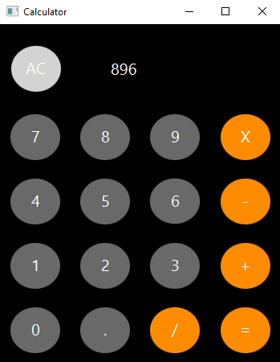
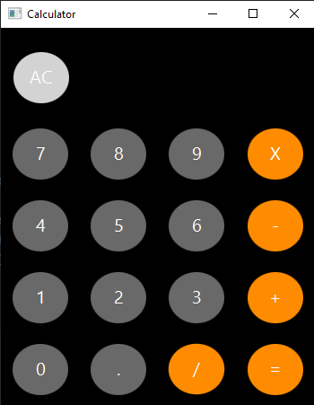
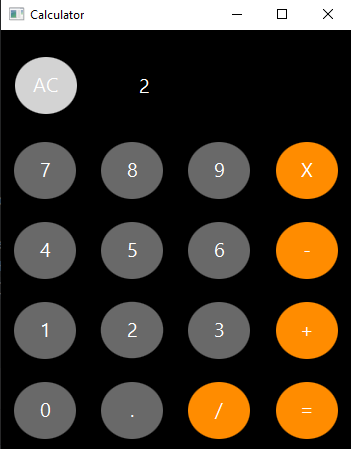
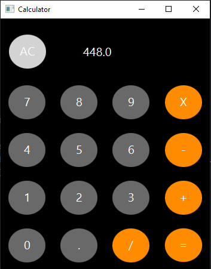
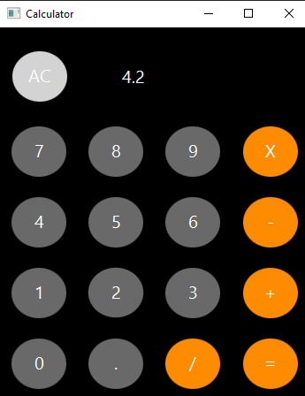
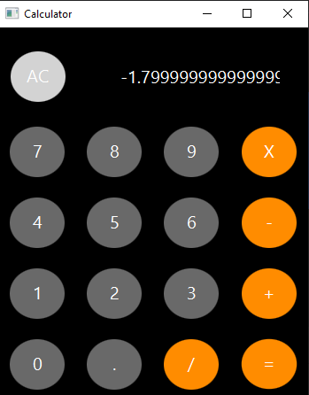
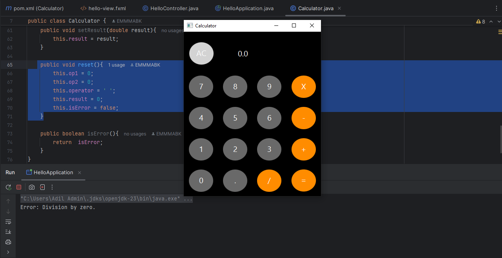

# JavaFX Calculator

A simple calculator application built using JavaFX, allowing users to perform basic arithmetic operations such as addition, subtraction, multiplication, and division. This calculator handles decimal values and includes error handling for division by zero.

## Features

- Basic arithmetic operations: addition, subtraction, multiplication, and division.
- Support for decimal numbers.
- Clear/reset functionality.
- Error handling for division by zero.
- Simple user interface with intuitive button controls.

## How to Run the Calculator Application

### Prerequisites
- Ensure you have **Java 11+** installed on your system.
- Install **JavaFX JDK**.

### Running the Application

1. **Clone the Repository:**
   ```bash
   git clone https://github.com/EMMMABK/Calculator.git
   cd Calculator
   ```

2. **Build and Run:**
   - Open the project in a JavaFX-compatible IDE (e.g., IntelliJ IDEA, Eclipse).
   - Add JavaFX library dependencies to the project.
   - Run the `HelloController` class as a JavaFX application.

## How to Use the Calculator

- **Input Numbers:** Click the number buttons (`0-9`) to input a number. Click the `.` button for decimal input.
- **Perform Operations:** 
  - Select `+`, `-`, `*`, or `/` for addition, subtraction, multiplication, or division.
  - Press `=` to compute the result.
- **Reset:** Click the `AC` button to clear the input field and reset the calculator.
- **Handling Division by Zero:** If division by zero is attempted, it shows an error message in the console and returns the result as 0.0.

## User Interface Screenshots











## Known Issues

1. **Error Handling for Division by Zero:** Application would only show an error in the console, not in the UI. This could be improved by revealing a pop-up error message.
2. **Decimal Input:** More than one decimal point can be entered, which might lead to invalid numeric values. Additionally, decimal input validation needs to be improved.
3. **UI Styling:** Currently, the calculator uses a very basic UI. Additional styling can be achieved through the use of custom CSS for enhanced looks.

## Explanation

JavaFX Calculator is a simple application designed for basic arithmetic operations: addition, subtraction, multiplication, and division. It supports the entering of numbers in decimal form, too. The main classes that compose it are HelloController and Calculator.
The HelloController class controls user input and the GUI display. Users can select buttons to enter numbers or a decimal point, or choose a mathematical operator (+, -, *, /) - store an operand, then choose "=", which retrieves the second operand and, via an instance of the Calculator class performs the actual calculation and shows the answer.
The calculation logic would go into the class 'Calculator', where the operands, operator, and result are kept. The 'calculate' method performs the selected action. In case of division by zero, it returns zero and sets the error flag on.
Reset Button: This simply cleans the input and resets the state of this simple calculator; hence, it is quite accessible to all users since the interface of this application is intuitive and easy to handle.
